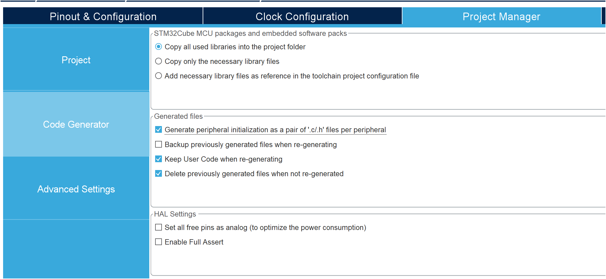

# CBoard Framework Homework

## 概述

大作业基于C板进行，并且自然地承接到后续小车控制的任务。我们希望通过这个作业让大家温习前面学过的所有知识，建立自己的嵌入式架构和知识体系，并为后续的嵌入式开发做好准备。请仔细阅读本文档以明确所有任务。

### 执行步骤
1. 本仓库创建时，只放入了一个完全空白的ioc工程，你需要从时钟开始配置，将之前的GPIO，串口，PWM，CAN等等所有内容自己重新完整配置一次，希望大家不要直接复制之前的板子，这是一个难得的温习过程。
2. 了解作业：作业分为学习-文档作业和开发作业。学习-文档作业需要自主学习底盘解算和初步了解姿态解算的相关知识，完成一个md文档，鼓励大家使用latex或者使用电子笔迹的方式写下自己的推导和想法，放在docs/下的两个md文档。开发作业需要在我们已经搭建的框架下进行完善，并阅读文档实现对C板BMI088的读取。
3. 思考如何和agent合作，将你的需求、理解、要求和agent进行交互并形成一个良好的项目规范、项目要求与执行计划，实现你的AGENTS.md并在开发过程中不断改进、完善，鼓励大家在独立思考的同时和agent进行有规划的交互。你应该选择一个可靠的agent。
4. 编写与调试，通过调试-修改-优化的循环实现你的功能，功能无法实现、出现报错的时候多自己思考一下，完全依赖agent无法解决问题。为每个功能设置易用的开关，或者通过线程是否启动进行区分，方便进行单元测试。你可以提前写好所有代码，但是测试的时候应当有选择地调试某些功能。

### 过程要求
这个作业对大家可能提出了比较高的要求，但是我们希望大家能通过努力从中真正学到开发要用的东西。
1. 如果你对C++/C，函数，类与对象还不熟悉，请你先进行自学。
2. 如果你对之前的配置、调试、编写还不熟悉，也请先复习熟悉。
3. 尽量独立思考、搜索、寻找答案，可以适当地提问，但是手把手的教学和解答将不再存在。
4. 鼓励通过文档 [logs](docs/logs.md) 记录自己的调试过程、迭代过程，为后续开发打好基础。

### 提交规范
1. 只有必要的agent产物被保留
2. 尽量完全遵循原有的结构设计与文档设计，保持项目的简洁
3. 文档、代码尽可能简洁并体现你的思考，而不是用agent写出来很长很冗余的产物
4. 保持你 git commit 的良好习惯，写清楚每一次commit做了什么

## 回顾

从培训到现在，我们一步一步进行了单片机上多种外设的认识、配置和操作，最终我们也理解了ThreadX操作系统和基本的嵌入式架构。

回顾之前的工作能够帮你温习已经学过的知识并进一步巩固、转化为自己的知识体系，大致可以总结为以下几个方向，可以通过下面的问题思考你是否掌握了相关知识。

### 基础配置与GPIO

### 信号与通信

### CAN，PID与电机控制

### RTOS与架构

## 学习-文档作业

### 底盘解算

搜索资料并掌握麦克纳姆轮、全向轮、舵轮的底盘解算
- 理解麦克纳姆轮、全向轮是如何通过辊子的排布实现全向移动的，并通过计算和推导理解如何将 $v_x,v_y,v_w$ 解算为四个轮子的线速度
- 理解舵轮是如何通过舵向电机和舵轮电机的配合实现全向移动的，并通过计算和推导理解如何将 $v_x,v_y,v_w$ 解算为舵向电机的角度和舵轮电机的速度

将解算和推导过程写下来，你可以使用md，可以手写上传图片，希望你能有一个良好的思考过程，如果能将过程和理解写下来就更好了。请将你的结果写到 [chassis](docs/chassis.md)

完成上面的部分之后，学习-文档作业的基础内容就已经完结，后续内容为选做。

### 功率计算

搜索资料并尝试了解
- 电机的功率是如何通过公式近似的
- 如何通过采样确定电机功率公式的常数，使用了什么方法，需要采集什么数据
- 不同轮组分别在什么场景下具有优势，半舵半全向这种构型为什么会存在

如果你有所发现，请添加到 [chassis](docs/chassis.md)

### 姿态解算

这部分需要的数学知识比较多，但是理解过后对于机器人的姿态、运动都会有更深入的了解。

搜索资料并尝试了解
- 旋转的基本表示有什么？三个欧拉角分别是什么？
- 二维的旋转可以使用虚数，那三维的旋转应该用什么表示？什么是四元数？
- 矩阵、旋转矩阵分别是什么？如何从简单的二维旋转推广到三维旋转？
- 四元数为什么能够表示旋转？
- 旋转矩阵如何和四元数互化？

## 开发作业

这部分的作业为必做。

### pre-requisites

了解这部分知识能够补全通信知识，帮你建立完整的通信知识体系。

搜索资料并了解
- 全双工、半双工通信分别指的是什么？
- 什么是SPI？SPI通信具有什么特点？
- 什么是IIC？IIC通信又有什么特点

### 配置

CheckLists

- 时钟树，注意主频
- GPIO，三种颜色的灯都需要配置
- PWM，控制舵机的那个口
- UART，把两个串口都打开
- CAN，打开并配置所有CAN
- SPI，根据数据手册进行配置
- IIC，根据数据手册进行配置
- Thread，优先级，栈空间，内存分配
- 整体的堆栈空间

完成配置并注意CMakeLists导出，同时建议勾选 .c/.h pair

### bsp

### libs
